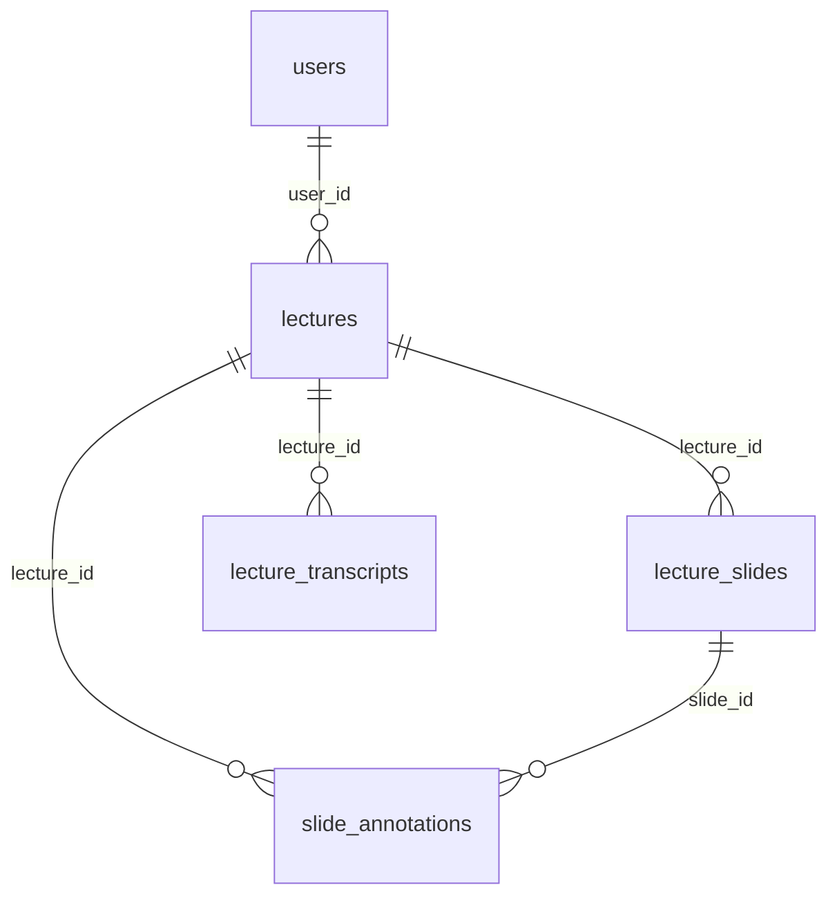

# Step 3: Spring Boot `server-core` 스캐폴딩

- 기간: 2026-09-20
- 커밋: (검토 후 커밋 예정)
- 최종 버전: **Spring Boot 4.1.1**, Java 21, Gradle 9.7.1 (처음에는 3.3.13으로 구성했다가 업그레이드, 아래 "변경 이력" 참고)

## 구현한 것

```
server-core/
├── build.gradle                          # Spring Boot 4.1.1, Java 21 toolchain
├── settings.gradle
├── gradlew, gradlew.bat, gradle/wrapper/ # Gradle 9.7.1
├── gradle/gradle-daemon-jvm.properties   # Gradle 데몬을 Java 21로 고정
├── .gitignore, .gitattributes
└── src/
    ├── main/java/com/lecturemate/
    │   ├── LectureMateApplication.java   # @SpringBootApplication + @ConfigurationPropertiesScan
    │   ├── config/
    │   │   ├── FastApiProperties.java    # lecturemate.fastapi.*
    │   │   └── StorageProperties.java    # lecturemate.storage.*
    │   └── domain/entity/
    │       ├── User.java, Lecture.java, LectureSlide.java,
    │       │   LectureTranscript.java, SlideAnnotation.java
    │       ├── LectureStatus.java        # lectures.status enum
    │       ├── LayoutWord.java           # layout_data JSONB 원소 (record)
    │       └── HighlightBox.java         # highlight_bboxes JSONB 원소 (record)
    ├── main/resources/application.yml
    └── test/java/com/lecturemate/
        ├── LectureMateApplicationTests.java     # 컨텍스트 로딩 + 스키마 validate
        └── domain/entity/EntityMappingTest.java # 실제 DB 대상 매핑 검증
```

**의존성 (Spring Boot 4 모듈 구조):**
- 메인: `spring-boot-starter-webmvc`, `-data-jpa`, `-websocket`, `postgresql`
- 테스트: `spring-boot-starter-webmvc-test`, `-data-jpa-test`, `-websocket-test`

**주요 라이브러리 버전 (4.1.1 BOM 기준):** Spring Framework 7.0.9, Hibernate 7.4.5, Jackson 3.1.5, Tomcat 11.0.24, PostgreSQL JDBC 42.7.13

## 코드 설명

### application.yml

```yaml
spring.datasource.url: ${SPRING_DATASOURCE_URL:jdbc:postgresql://localhost:5432/lecturemate}  # SPEC §5.1
spring.datasource.username/password: ${SPRING_DATASOURCE_USERNAME/PASSWORD:postgres}          # docker-compose 계정
spring.servlet.multipart.max-file-size: 50MB         # 강의 PDF 업로드 최대 크기
spring.servlet.multipart.max-request-size: 55MB      # 파일 + title 등 요청 전체
spring.jpa.hibernate.ddl-auto: validate
spring.jpa.open-in-view: false
spring.jpa.properties.hibernate.jdbc.time_zone: UTC
server.port: 8080                                    # FastAPI의 SPRING_BOOT_WEBHOOK_URL 포트와 맞춤
lecturemate.fastapi.base-url: ${FASTAPI_ENGINE_URL:http://localhost:8000}   # SPEC §5.1
lecturemate.fastapi.connect-timeout: 5s
lecturemate.fastapi.read-timeout: 120s
lecturemate.storage.local-path: ${STORAGE_LOCAL_PATH:${user.home}/lecturemate/storage}
```

- `lecturemate.*` 설정은 `FastApiProperties`와 `StorageProperties` 레코드에 타입 안전하게 바인딩됩니다. 이후 `FastApiClient`나 파일 저장 서비스에서 주입받아 씁니다.
- FastAPI WebSocket 주소(§2.2-5)는 별도 설정을 두지 않고, `base-url`의 스킴만 `http`에서 `ws`로 바꿔 만들 예정입니다.

### 파일 저장 경로 (`STORAGE_LOCAL_PATH`)

업로드된 PDF와 녹음된 오디오를 저장하는 디스크 위치입니다.

```
브라우저 ──PDF 업로드──▶ Spring Boot ──저장──▶ {STORAGE_LOCAL_PATH}/pdf/101.pdf
                              └─ POST /ai/v1/pdf/parse { "pdf_path": "<절대경로>" } ──▶ FastAPI가 이 경로의 파일을 직접 엶
```

| 환경 | 값 | 설정 방법 |
|---|---|---|
| 로컬 개발 (macOS) | `~/lecturemate/storage` | 기본값. 따로 설정할 필요 없음 |
| 서버 (EC2) | `/data/lecturemate/storage` (SPEC 값) | 환경 변수 `STORAGE_LOCAL_PATH` |

- **로컬 기본값을 바꾼 이유:** macOS는 루트(`/`)가 읽기 전용 시스템 볼륨이라 `/data`를 만들 수 없습니다.
- **상대경로를 쓰지 않은 이유:** Spring Boot는 `server-core/`, FastAPI는 `ai-engine/`에서 실행되어 같은 상대경로도 서로 다른 위치를 가리킵니다. 홈 디렉토리 아래 절대경로를 쓰면 두 프로세스가 항상 같은 파일을 봅니다.
- **나중에 주의할 점:** 이 방식은 Spring Boot와 FastAPI가 **같은 디스크를 볼 때만** 동작합니다. `ai-engine`만 별도 GPU EC2로 옮기면 S3 같은 공유 저장소가 필요합니다.

### 엔티티와 테이블 매핑

| 엔티티 | 테이블 | 쓰는 쪽 | 비고 |
|---|---|---|---|
| `User` | `users` | Spring Boot | 생성자 `User(email, passwordHash, name)` |
| `Lecture` | `lectures` | Spring Boot | 생성자 `Lecture(user, title)`, `status` 초기값 `INITIALIZED` |
| `LectureSlide` | `lecture_slides` | **FastAPI** | 조회 전용. `embedding` 미매핑 |
| `LectureTranscript` | `lecture_transcripts` | **FastAPI** | 조회 전용. `embedding` 미매핑 |
| `SlideAnnotation` | `slide_annotations` | **FastAPI** | 조회 전용 |

공통 규칙:
- PK는 `BIGSERIAL`이므로 `@GeneratedValue(strategy = IDENTITY)`를 씁니다.
- JPA가 요구하는 `protected` 기본 생성자와 getter만 두고 setter는 두지 않았습니다. 상태를 바꾸는 메서드는 기능을 구현할 때 필요한 것만 추가합니다.
- `TIMESTAMP WITH TIME ZONE` 컬럼은 `OffsetDateTime`으로 받습니다. DB에는 UTC로 저장합니다.
- **Spring Boot가 쓰는 엔티티** (`User`, `Lecture`): `@CreationTimestamp`와 `@UpdateTimestamp`로 `created_at`, `updated_at`을 채웁니다. DB에 `updated_at` 트리거가 없어서 애플리케이션이 갱신해야 합니다.
- **FastAPI가 쓰는 엔티티:** `created_at`을 `insertable=false, updatable=false`로 두어 DB 기본값 `NOW()`를 그대로 따릅니다. `public` 생성자가 없어서 Spring Boot 코드에서 실수로 새로 만들 수 없습니다.
- **JSONB 컬럼** (`layout_data`, `highlight_bboxes`): `@JdbcTypeCode(SqlTypes.JSON)`과 `List<record>`로 매핑합니다. Hibernate 7이 Jackson 3로 직렬화와 역직렬화를 합니다. `HighlightBox(word, bbox, color)`는 SPEC §2.1-4 응답의 `highlights` 원소와 모양이 같아서 API 응답에 그대로 쓸 수 있습니다.
- **`status`:** `@Enumerated(STRING)`으로 DB에 `'READY'` 같은 문자열로 저장합니다.

### 엔티티 관계



- 모든 연관관계는 **단방향 `@ManyToOne(fetch = LAZY)`**이고, 부모 쪽에 `@OneToMany` 컬렉션을 두지 않았습니다.
  - 강의 하나에 슬라이드 수십 장, 전사 세그먼트 수백 개가 붙습니다. 컬렉션을 두면 실수로 전부 로딩하기 쉽습니다.
  - 필요한 데이터는 Repository에서 `lectureId`와 `pageNumber` 조건으로 조회합니다. 이 조건은 SPEC 인덱스(`idx_*_lecture_page`)와 일치합니다.
- `Lecture.user`만 `optional = false`입니다(DB `NOT NULL`). 나머지 `lecture_id`와 `slide_id`는 SPEC 스키마상 nullable이라 그대로 두었습니다.
- 삭제는 DB의 `ON DELETE CASCADE`가 처리합니다. JPA에 cascade를 따로 설정하지 않았습니다.
- `SlideAnnotation`은 `slide_id`와 `lecture_id`를 둘 다 가지고 `page_number`는 비정규화되어 있습니다. SPEC §2.1-4 API(`/lectures/{id}/pages/{page}/annotations`)를 슬라이드 조인 없이 `(lecture_id, page_number)` 인덱스로 바로 조회하기 위한 구조입니다.

## 이렇게 한 이유

- **`ddl-auto: validate`:** 스키마는 `db/init.sql` 하나가 관리하고, Hibernate는 엔티티가 스키마와 맞는지만 확인합니다. FastAPI도 같은 테이블을 쓰기 때문에 Hibernate가 스키마를 바꾸면 안 됩니다.
- **`embedding` 컬럼을 매핑하지 않음:** 벡터 검색은 FastAPI만 합니다(§2.2-3). Spring Boot에서 매핑하면 슬라이드 하나 조회할 때마다 float 1024개를 불필요하게 읽고, `hibernate-vector` 의존성도 추가해야 합니다. `validate`는 매핑된 필드만 검사하므로 문제가 없습니다.
- **`open-in-view: false`:** 트랜잭션이 끝난 뒤 뷰나 컨트롤러에서 lazy loading이 일어나는 것을 막습니다. SSE와 WebSocket 스트리밍 중에 DB 커넥션을 오래 붙잡는 것도 방지합니다.
- **업로드 50MB (사용자 결정):** Spring 기본값이 1MB라 실제 강의 PDF는 거부됩니다. FastAPI는 파일을 직접 받지 않고 경로만 받으므로 FastAPI 쪽 설정은 필요 없습니다. 나중에 Nginx 같은 프록시를 앞에 두면 `client_max_body_size`도 같이 올려야 합니다.
- **`read-timeout: 120s`:** `POST /ai/v1/pdf/parse`는 동기 호출이고 PDF 파싱과 bge-m3 임베딩까지 끝나야 응답합니다. 그래서 넉넉하게 잡았습니다. SPEC에 값이 없어서 정한 기본값이며, 실제 측정 후 조정합니다.
- **Lombok 미사용:** 지시받은 의존성에 없어서 넣지 않았습니다.
- **Repository는 만들지 않음:** Step 3 지시 범위가 "JPA Entity"까지였기 때문입니다. SPEC §4.1의 Repository는 기능을 구현할 때 만듭니다.
- **Spring Security와 JWT는 별도 인증 단계에서 (사용자 결정):**
  - JWT는 로그인 후 요청마다 사용자를 식별하는 토큰이고, `lectures.user_id`를 채우는 근거가 됩니다.
  - 하지만 SPEC §2.1에 회원가입과 로그인 API가 정의되어 있지 않습니다. 의존성만 먼저 넣으면 모든 API가 401을 반환합니다.
  - 그래서 Step 4 이후 "인증 단계"에서 SPEC에 API를 정의하고, 의존성 추가와 구현을 한 번에 진행합니다.

## 변경 이력: Spring Boot 3.3.13 → 4.1.1

| 버전 | 최신 패치 | OSS 지원 종료 |
|---|---|---|
| 3.3.x | 3.3.13 | 2025-06-30 (종료) |
| 3.5.x | 3.5.16 | 2026-06-30 (종료) |
| 4.0.x | 4.0.8 | 2026-12-31 |
| **4.1.x** | **4.1.1** | **2027-07-31** |

- 처음에는 SPEC에 적힌 대로 3.3.13으로 구성했습니다. 3.3.x는 지원이 끝난 버전이라 사용자에게 업그레이드를 제안했습니다.
- **정정:** 처음에는 "3.5.x로 올리자"고 제안했는데, 다시 확인해 보니 3.5.x도 2026-06-30에 지원이 끝난 상태였습니다. 지원이 남아 있는 4.1.1로 결정했고, `SPEC.md`와 `AGENTS.md`의 버전 표기도 `4.1.x`로 바꿨습니다.

업그레이드하면서 바뀐 것:

| 항목 | 3.3.13 | 4.1.1 |
|---|---|---|
| Web starter | `spring-boot-starter-web` | `spring-boot-starter-webmvc` |
| 테스트 starter | `spring-boot-starter-test` 하나 | 모듈별 `-webmvc-test`, `-data-jpa-test`, `-websocket-test` |
| `@DataJpaTest` 패키지 | `o.s.boot.test.autoconfigure.orm.jpa` | `o.s.boot.data.jpa.test.autoconfigure` |
| `@AutoConfigureTestDatabase` 패키지 | `o.s.boot.test.autoconfigure.jdbc` | `o.s.boot.jdbc.test.autoconfigure` |
| Gradle | 8.14.3 | 9.7.1 |
| Hibernate / Jackson | 6.5 / 2.x | 7.4.5 / 3.1.5 |

엔티티 코드는 바꿀 필요가 없었습니다. `jakarta.persistence`, `@JdbcTypeCode`, `@CreationTimestamp` 모두 그대로 동작합니다. Jackson 3에서도 JSONB가 제대로 변환되는 것은 `EntityMappingTest`로 확인했습니다.

## 트러블슈팅

| 문제 | 원인 | 해결 |
|---|---|---|
| Spring Initializr에서 3.3.x를 고를 수 없음 | Initializr는 지원 중인 버전(4.0.x 이상)만 제공 | 3.3.13 구성 때는 wrapper만 받고 `build.gradle`을 직접 작성. 이후 4.1.1로 올리면서 Initializr 4.1.1 결과물을 기준으로 의존성 구성 |
| Spring Boot 3.3과 Gradle 9 비호환 | Boot 3.3 Gradle 플러그인은 Gradle 7.6.4+/8.x만 지원 | 3.3 시기에는 Gradle 8.14.3 사용. 4.1.1로 올리면서 Initializr 기본값인 9.7.1로 변경 |
| 시스템 기본 JDK가 26 | 빌드는 Java 21 대상이고, Gradle 8.14는 Java 24까지만 실행 지원 | `gradle/gradle-daemon-jvm.properties`(`toolchainVersion=21`)로 **데몬을 Java 21로 고정**. 런처는 JDK 26에서 떠도 문제없음. 컴파일도 `java.toolchain`으로 21 사용. Gradle 9.7.1에서도 같은 설정 유지 |
| 업그레이드 후 테스트 컴파일 오류 가능성 | Boot 4에서 테스트 자동설정 어노테이션 패키지가 이동 | import 경로 수정 (위 표) |
| 테스트 로그의 `A Java agent has been loaded dynamically` 경고 | 테스트 starter에 포함된 Mockito(byte-buddy)가 에이전트를 동적으로 붙임 | 동작에는 영향 없음. 거슬리면 나중에 테스트 JVM 옵션 `-XX:+EnableDynamicAgentLoading` 추가 |
| `bootRun` 확인 후 8080 포트가 계속 사용 중 | `pkill -f LectureMateApplication`이 Gradle이 띄운 프로세스와 매칭되지 않음 | `lsof -tiTCP:8080`으로 PID를 찾아 종료. 보통은 `bootRun` 터미널에서 Ctrl+C로 종료하면 됩니다 |

## 검증 결과 (4.1.1 기준)

- `./gradlew clean build`: **BUILD SUCCESSFUL**, 테스트 3개 통과 (로컬 postgres 컨테이너 필요)
  - `LectureMateApplicationTests.contextLoads`: 전체 컨텍스트가 뜨고, `ddl-auto: validate`로 엔티티와 `init.sql` 스키마가 일치함을 확인
  - `EntityMappingTest.persistsUserAndLectureWithDefaults`: `User`와 `Lecture` 저장, `status` 기본값, 타임스탬프 자동 입력, LAZY 연관 조회
  - `EntityMappingTest.readsFastApiOwnedRowsIncludingJsonb`: FastAPI 대신 네이티브 SQL로 슬라이드, 전사, 주석을 넣은 뒤 JPA로 읽어 JSONB가 `List<LayoutWord>`와 `List<HighlightBox>`로 변환되는지 확인
  - 테스트는 트랜잭션 롤백으로 끝나며, 실행 후 DB에 남은 데이터가 0건임을 확인
- `./gradlew bootRun`: `Spring Boot :: (v4.1.1)`, 약 1.8초 만에 기동, 로그 WARN 0건. 컨트롤러가 없으므로 `GET /`는 404

## 사용법

```bash
docker compose up -d postgres   # 프로젝트 루트에서, DB 필요
cd server-core
./gradlew bootRun               # 실행
./gradlew test                  # 테스트 (DB 필요)
```
